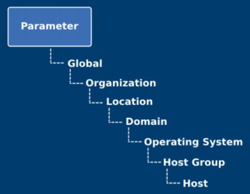
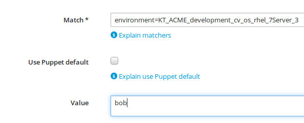

= Satellite 6: Getting started with Puppet Forge Modules
Rodrique Heron <rheron@redhat.com>
:Author Initials: RAH
:vernum: 1.0.0
:toc: left           //displays the TOC on the left-hand side of the HTML
:toclevels: 2     //shows 2 level of headings in the TOC
:numbered:      //allows numbered headings
:icons: font

This guide walks through getting started with Puppet Forge modules and Satellite 6. The end result is understanding how to write a Puppet module that takes full advantage of Puppet's smart variales and smart parameter class.

== Introduction to Puppet

Puppet is a configuration management and automation tool that describes host system resources and state using Puppet’s declarative language. The data and code that describes host system resources and state are bundled into a module. This module then exposes named blocks of code referred to as classes that can be applied to a host system. Modules are shared and hosted on the Puppet Forge website.

Satellite 6 provides a single pane for applying Puppet’s classes to host systems and values for attributes defined in a Puppet class can be separated from Puppet’s code, and stored in Satellite 6. In Puppet, this mechanism is referred to as an External Nodes Classifier (ENC). Satellite 6 is ENC that allows you to provide class declarations, parameters and variables to Puppet.

=== Puppet Forge

Puppet Forge is a repository of modules written by Puppet's community that is available for download and use with Satellite 6. It’s best to recognized that modules on Puppet Forge are meant to be used as libraries.

For the most part modules on Puppet Forge will work with Satellite 6. However, it's best to choose puppet are compatible with RedHat base distro and Puppet version 3.6.x.

image::images/puppet-forge.png[Puppet Forge Filter]

=== Puppet Basics

Getting into the weeds of Puppet is outside the scope of this guide, however here are some key concepts to understand before we continue. For this exercise I’ll use code from `halyard/sudoers` puppet module.

==== Resource Types and Attributes

The module `halyard/sudoers` primary function is to give a user root access to a command. It creates a /etc/sudoers.d/<resource-title> file with the defined attributes of a resource type. Let’s examine the below code.

[source,ruby]
----
sudoers::allowed_command{ "acme":            # <1> <2>
    command          => "/usr/sbin/service", # <3>
    user             => "acme",
    require_password => false,
    comment          => "Allows access to the service command for the acme user"
  }
----
<1> `sudoers::allowed_command` is called a resource type
<2> `acme` is called the resource title, which results in the name of the sudoers file created: `/etc/sudoers.d/acme`
<3> `command, user, require_password, comment` are all attributes, that accepts a value

==== Manifest

All puppet code lives in a file called a manifest with the `.pp` extension.

Let's create a manifest to manage a `user` resource type. We can quickly generate the code for this using the `puppet resource type title` command.

. Generate code to create a user name john.joe
[source,bash]
$ puppet resource user john.doe
user { 'john.doe':
  ensure => 'absent',
}
+
. Create a manifest called `user.pp` with the above code and change the attribute `ensure` from absent to present.
[source,bash]
$ cat user.pp
user { 'john.doe':
  ensure => 'present',
}
+
. Now lets apply this resource
[source,bash]
puppet apply user.pp
Notice: Compiled catalog for test-001.example.com in environment production in 0.14 seconds
Notice: /Stage[main]/Main/User[john.doe]/ensure: created
Notice: Finished catalog run in 0.14 seconds
+
. Now we can confirm the user was created
+
[source.bash]
----
$ id john.doe
uid=1000(john.doe) gid=1000(john.doe) groups=1000(john.doe)

$ grep john.doe /etc/passwd
john.doe:x:1000:1000::/home/john.doe:/bin/bash
----

==== Classes

Classes are just blocks of code with an name, i.e. named blocks.

Let's pick up from where we last left off with `halyard/sudoers` module. To use the resource type `sudoers::allowed_command` provided by this module with Satellite 6, we must define it in a class.

[source,ruby]
----
class foo_sudoers {                            <1>
  sudoers::allowed_command { "acme":        <2>
    command          => "/usr/sbin/service",
    user             => "acme",
    require_password => false,
    require_exist    => false,
    comment          => "Allows access to the service command for the acme user"
  }
}                                           <3>
----

<1> This definition requires the keyword `class` followed by the name of the class `food_sudo` and opening curly braces
<2> The resource type `sudoers::allowed_command`
<3> Finally closing curly brace

==== Module

A Puppet module bundles puppet manifest, along with other data in a specific directory structure. Just like RPMs, modules are the only way to store puppet code in Satellite 6.

The below command is how we create a module.

[source,bash]
----
$ puppet module generate acme-foo_sudoers --skip-interview  # <1>
Notice: Generating module at /tmp/foo_sudoers...
Notice: Populating templates...
Finished; module generated in foo_sudoers.
foo_sudoers/README.md
foo_sudoers/metadata.json                                  # <2>
foo_sudoers/Rakefile
foo_sudoers/tests
foo_sudoers/tests/init.pp
foo_sudoers/spec
foo_sudoers/spec/spec_helper.rb
foo_sudoers/spec/classes
foo_sudoers/spec/classes/init_spec.rb
foo_sudoers/manifests                                     # <3>
foo_sudoers/manifests/init.pp                             # <4>
foo_sudoers/Gemfile
----
The key details about the above output are:
+
<1> Puppet recommends generating modules prefix with your username.
<2> The `metadata.json` file is required. Each time your module change, bump the version number by editing this file.
<3> All your puppet manifest lives in this directory.
<4> It's common practice to always include a `init.pp` with your module.

[NOTE]
====
As per Puppetlabs documentation, `init.pp` is special and always contains a class with the same name as the module.

Although not required, it is common practice to always create a `init.pp`. Basically, classes in `init.pp` gets executed by default if no other class is declared.
====

== Our First Puppet Module

Let's create our first Puppet module using the basic Puppet knowledge we have so far. Recommend practices for setting your Puppet development area is outside the scope of the guide. For this example, I'm using a RHEL system that's registered to Satellite 6.

. Create a module template
[source,bash]
$ puppet module generate acme-foo_sudoers --skip-interview
+
. Add this code to `acme-foo_sudoers/manifests/init.pp` replacing the existing code
[source,ruby]
cat > acme-foo_sudoers/manifests/init.pp <<EOF
class foo_sudoers {
  sudoers::allowed_command { "acme":
    command          => "/usr/sbin/service",
    user             => "acme",
    require_password => false,
    require_exist    => false,
    comment          => "Allows access to the service command for the acme user"
  }
}
EOF
+
. Simple Puppet code validation
[source,bash]
$ puppet parser validate acme-foo_sudoers/manifests/init.pp
+
. We can also apply this module locally to ensure it's working. First we need to download the `halyard/sudoers` module which contains all the pluming we need. This step assumes your workstation as direct access to the Internet. We installing the module to `/root/development`.
[source,bash]
$ puppet module install halyard/sudoers --target-dir /root/development/
+
. Next rename our module from acme-foo_sudoers to foo_sudoers
[source,bash]
$ mv acme-foo_sudoers foo_sudoers
+
. Now lets apply the foo_sudoers class locally.
[source,bash]
$puppet apply --modulepath=. -e "include foo_sudoers"  # <1>
Notice: Compiled catalog for test-001.example.com in environment production in 0.21 seconds                                           # <2>
Notice: /Stage[main]/Sudoers/File[/etc/sudoers.d]/mode: mode changed '0750' to '0770'                                                 # <3>
Notice: /Stage[main]/Foo_sudoers/Sudoers::Allowed_command[acme]/File[/etc/sudoers.d/acme]/ensure: defined content as '{md5}a37d9a3bc7fe83ea5da53e0194d23df4' # <4>
Notice: Finished catalog run in 0.21 seconds # <5>
+
<1> `--modulepath`, both modules live in the current directory, `-e "include foo_sudoers"` means we are applying the class `foo_sudoers`
<2> Puppet manifest are complied into a https://docs.puppetlabs.com/puppet/4.3/reference/subsystem_catalog_compilation.html[catalog], which are then applied.
<3> Permissions for `/etc/sudoers.d` was changed to `0770`
<4> /etc/sudoers.d/acme created with rule define by our puppet class
<5> How long it took to apply the catalog
+
. Verify sudoers was created for user `acme`
[source,bash]
$ cat /etc/sudoers.d/acme
# Allows access to the service command for the acme user
acme ALL=(root) NOPASSWD: /usr/sbin/service
+
. Build the puppet module
[source,bash]
$ puppet module build foo_sudoers
Notice: Building /root/development/foo_sudoers for release
Module built: /root/development/foo_sudoers/pkg/acme-foo_sudoers-0.1.0.tar.gz

This last step produces `acme-foo_sudoers-0.1.0.tar.gz` which how Satellite 6 accepts manually uploaded Puppet modules.

==== Add Puppet Modules To Satellite 6

Before we can upload `acme-foo_sudoers-0.1.0.tar.gz` module to Satellite, we need to create a custom product to store our custom puppet modules, along with Puppet Forge modules.

===== Create a Custom Puppet Product

. Log into your Satellite instance
+
. Navigate to Content -> Products
+
. Click
+

+
. Enter a `Name` for your product, for this guide we will use `ACME Puppet Modules` and click `Save`
+

+
. Ensure product `ACME Puppet Modules` > `Repositories` is selected and click `Create Repository`
+
image::images/select-product.png[Product selected]
. Enter a `Name` for your repo, for this guide we will use `Puppet Forge Repo` and ensure `Type` is set to `puppet`, `URL` set to `http://forge.puppetlabs.com`, then click `Save`
+
image::images/create-puppet-repo.png[Puppet Forge repo]
+
. Sync the repository, click the check box next to `Puppet Forge Repo`, then click `Sync Now`
+

+
. Finally, let's create another repo to store our custom puppet modules. Enter a `Name` for your repo, for this guide we will use `ACME Puppet Modules Repo` and ensure `Type` is set to `puppet` and click `Save`

===== Add Puppet Module to Custom Product Repository

====== From the WebUI
. Naviagte to `Content` > `Products`, select `ACME Puppet Modules`, under `Repositories`, select `ACME Puppet Modules Repo`
+
. Under the heading `Upload Puppet Module`, select `Choose Files`, then `Upload` to add our custom puppet module to Satellite.
+

====== Using hammer cli Tool
. Install and setup hammer config, edit the config to match your environment.
[source,bash]
$ yum -y install rubygem-hammer_cli_katello rubygem-hammer_cli
$ mkdir /root/.hammer/
$ cat > /root/.hammer/cli_config.yml <<EOF
:foreman:
    :host: 'https://server.example.com/'
    :username: 'username'
    :password: 'password'
EOF
+
. Get ACME Puppet Repository ID
[source,bash]
$ hammer repository list --organization ACME --search 'name ~ "Puppet Forge Repo"'
---|-------------------------|--------------------|------------|------
ID | NAME                    | PRODUCT            |CONTENT TYPE| URL
---|-------------------------|--------------------|------------|------
9  | ACME Puppet Modules Repo| ACME Puppet Modules|  puppet    |
---|-------------------------|--------------------|------------|------
+
. Upload module
[source,bash]
$ hammer repository upload-content --id 9 --path=foo_sudoers/pkg/acme-foo_sudoers-0.1.0.tar.gz
Successfully uploaded file 'acme-foo_sudoers-0.1.0.tar.gz'.

==== Add Puppet Module To Content View

This assumes you already have a Content View and Life Cycle Environments setup. For this guide, we are using a Content View name `cv-os-rhel-7Server`.

. Navigate to Content -> Content Views -> `cv-os-rhel-7Server` -> Puppet Modules
+

+
. Click `Add New Module`, and type foo in Filter search box
+
. Click “Select a Version” then select the latest version.
+

+
. Repeat the above steps to add `sudoers` module, chose the lastest by `halyard`
+
. Finally, publish then promote new version to a life cycle environment.

===== Example hammer command publish > promote to Development
. Get content view id
[source,bash]
$ hammer --csv content-view list --organization ACME --search 'name ~ cv-os-rhel-7Server'
Content View ID,Name,Label,Composite,Repository IDs
3,cv-os-rhel-7Server,cv-os-rhel-7Server,,"4, 1, 2, 6"
+
. Publish content view
[source,bash]
$ hammer content-view publish --organization ACME --name cv-os-rhel-7Server --description 'Added foo_sudoers'
[..........................................................] [100%]
+
. Get latest version of `cv-os-rhel-7Server` from Environment Library
[source,bash]
$ hammer --csv content-view version list --content-view-id 3 --environment Library --organization ACME
ID,Name,Version,Lifecycle Environments
4,cv-os-rhel-7Server 2.0,2.0,Library
+
. Promote version `2.0` of `cv-os-rhel-7Server` to Development
[source,bash]
$ hammer content-view version promote --content-view-id 3 --to-lifecycle-environment Development --id 4 --async --organization ACME
Content view is being promoted with task c5feb6f5-28e5-4171-89bf-04271208d942
+
. Monitor status, grabbing the task number from the last output `c5feb6f5-28e5-4171-89bf-04271208d942`
[source,bash]
$ hammer task progress --id c5feb6f5-28e5-4171-89bf-04271208d942

=== Associating a Puppet Class with a Host

First, remove `/etc/sudoers.d/acme` from your client host. My client that registered to Satellite is name`test-001.example.com`.

. Navigate to `Hosts` > `All hosts`
+
. Click `Edit` to the right of your host, on this page ensure you have the correct `Content View`, `Puppet CA` and `Puppet Master` selected.
+
. Next click on “Puppet Classes”, then under “Available Classes”, click the + next “foo_sudoers”. This will expand, then click the plus to the right of “foo_sudoers”. Now the the class will show up under “Included Classes”.
+

[TIP]
The better approach is to apply classes via Hostgroups or Config groups, We will explore this later on.

==== Run Puppet Agent

. ssh to your satellite client
+
. Execute puppet agent -t
[source,bash]
$ puppet agent -t
+
. Verify sudoers file was created

[source,bash]
$ ll /etc/sudoers.d/acme
-r--r-----. 1 root root 103 Mar 19 23:51 /etc/sudoers.d/acme

=== Summary

We use wrote a Puppet module using to create a sudoers file for user `ACME` using `halyard/sudoers` from Puppet Forge as a library. We could not have just selected `halyard/sudoers` module, add to our content view, publish, promote, associate with a host. The reason, for this particular module is that it's resource type `sudoers::allowed_command` is called a https://docs.puppetlabs.com/puppet/latest/reference/lang_defined_types.html[defined] type. Not all modules on Puppet Forge are like this, some modules can be used directly with Satellite 6 with wrapping them in your own module. By the end of this guide you should be able to figure out how to use any Puppet Forge module with Satellite 6.

== Separating configuration data from code

When developing a puppet modules for use with Satellite 6, you will need to ensure you can access the attribute values of the classes in your module, without touching your puppet code.

Let's revisit our puppet class:

[source,ruby]
class foo_sudoers {
  sudoers::allowed_command{ "acme":
    command          => "/usr/sbin/service",
    user             => "acme",
    require_password => false,
    require_exist    => false,
    comment          => "Allows access to the service command for the acme user"
  }
}

The attributes values are included with the class. This would require us to build, upload, update content view, publish then promote content view each time we want to change the values of `foo_sudoers` class.

=== Satellite 6 Parameters

From this point on, attribute values or variables will be referred to as parameters.
[NOTE]
====
A parameter is a special kind of variable in computer programming language that is used to pass information between functions or procedures. The actual information passed is called an argument.
- Definition from https://www.techopedia.com/definition/3725/parameter-param[Techopedia]
====

*Satellite 6 presents two personas when it comes to parameters:*

. Parameters that are available to Puppet and other components such as Satellite 6 template types. These parameters can be defined in the following areas.
+

+
The order of precedence is Host parameter always wins.
+
- Image from https://access.redhat.com/articles/1585273[2015 - 10 Steps to Build an SOE]
+
. Parameters that are available to Puppet only. These are primarily defined under `Configure` > `Puppet Classes`.
+
- *Smart Variables*
+
Essentially any Puppet parameter can be represented as a Satellite 6 Smart Variable. This allows for changing a Puppet parameter value from Satellite 6 UI.
+
- *Smart Class Parameter*
+
Similar to `Smart Variables`, the difference is `Smart Variables` require you to redefine your Puppet parameters within Satellite 6 and `Smart Class Parameter`  does not. `Smart Class Parameter` requires you to write Puppet classes that permits detecting, importing, and supplying parameters to Satellite 6. This type of class is called a parameterized class.

*Three major difference between the personas are:*

. Smart Variables and Smart Class Parameter overrides can be done at the hostgroup and host level.
+
. Overrides for the other parameters can only be done at the host level. Overrides allows specifying a different value for a class parameter at the hostgroup or host level.
+
. Smart Variables and Smart Class Parameter supports a feature in Satellite 6 known as Matchers. Matchers allows for setting a different parameter value base on attributes such as, hostgroup and fqdn. Matchers are covered in Section 4.

=== Satellite 6 Smart Variables

Smart variables are a stepping stone to to Smart Class Parameters. To make our puppet class compatible with Smart Variables we need to change all the hard coded parameter values into variables.

Change all the parameter values into variables.

[source,ruby]
class foo_sudoers {
  sudoers::allowed_command{ $sudoers_title:
    command          => $sudoers_command,
    user             => $sudoers_user,
    require_password => $sudoers_password,
    require_exist    => $sudoers_require_user,
    comment          => $sudoers_comment
  }
}

Next we need to add all six parameter variables to Satellite 6. Start by going to:

. Configure > Puppet Classes
+
. Type `foo_sudoers` in the search box
+
. Select the `foo_sudoers` class
+
. Then select the `Smart Variables` tab
+
. Click `Add Variable`, fill out the following:
+
- Parameter = sudoers_title
- Description = username to modify
- Parameter type = string
- Default value = acme
+

+
. Repeat until all 6 parameters are created. Remember to set the correct Parameter type of boolean for `sudoers_require_user` and `sudoers_password`.
+
. Finally click Submit, which take you back to the Puppet classes listing
+
. Select foo_sudoers again, and it should resemble this.
+

[NOTE]
====
This highlights a major difference between *Smart Variables* and *Smart Class Parameters*. At some point you will have to decide where you want to spend your time creating puppet parameters. Adding the 6 parameters from our Puppet class wasn't so bad, but imagine doing this for a 1000 classes.
====

==== Upload and Test
. Increment the version number by editing *metadata.json*
+
[source,bash]
$ sed -i 's/0.1.0/0.1.1/' foo_sudoers/metadata.json
+
. Increment the version number
+
. Build the module
+
. Up load the module Satellite 6
+
. Add new version to Content view
+
. Publish Content view with `foo_sudoers` module
+
. Promote Content view
+
. Test puppet client, you can change the values and run `puppet agent -t` to observe the changes.

=== Satellite 6 Smart Class Parameter

If I were to hand off `foo_sudoers` module to a person on my team setting up Satellite 6. I would have to also take the time to document all the parameters that needs to be created via Satellite 6 Smart variable. Otherwise, the person receiving the hand off would have to look at the Puppet code to figure out what parameters are available.

Instead, what you should want is for Satellite to tell you what variables are available, this is what’s called a *Smart Class Parameter* and known as parameterized class in Puppet.

==== Construct A Parameterized Class

Let's modify `foo_sudoers` class to look like this.

[source,ruby]
class foo_sudoers (                                  <1>
  $sudoers_command       = "/usr/sbin/service",
  $sudoers_user          = "acme",
  $sudoers_password      = false,
  $sudoers_require_user  = false,
  $sudoers_title         = "acme",
  $comment               = "Allows access to the service cmd.."
) {                                                  <2>
  sudoers::allowed_command{ $sudoers_title:
    command          => $sudoers_command,
    user             => $sudoers_user,
    require_password => $sudoers_password,
    require_exist    => $sudoers_require_user,
    comment          => $comment
  }
}

<1> What we have here is we took the parameter variables and enclose them in parenthesis, and added some default values. We refer to this as the parameter list.

<2> Which is then followed by curly brace and the puppet code describing resource types, ending with curly brace.

Next, increment metadata.json, build, upload module, then publish, promote content view. Navigate to Puppet classes > `foo_sudoers` > Smart Class Parameter. You should see all parameters populated.

To change a parameter value, select the parameter, then check the `Override` checkbox.

=== More About Smart variables and Smart Class Parameter

Both Smart variables and Smart Class Parameter provides some additional attributes, here are some additional notes on the available attributes.

* *Puppet Environments*: Just information, telling you which content view this class lives in
* *Description*:
Purely information text box for making notes in. Not passed to Puppet, or reused anywhere else
* *Override (important)*: If this is unchecked, Satellite 6 will not attempt to control this variable, and it will not be passed to Puppet via the ENC. *This does not apply to Smart variables*.
* *Key type*: Data type, string, hash, yaml, json etc..
* *Default Value*: Recommend practice is to set sensible default values.
* *Optional input validator*: Use to restrict the allowed values for the parameter For example, to restrict sudoers_user parameter to either bob or tom.
+

+
Optional input validator enforces on Puppet Classe and Host level
* *Override value for specific hosts*: This is covered next.

=== Matchers

Satellite Matchers allows for setting different paramter value base on the following attributes.

Let’s say for the class paramater `sudoers_user` should have the value of *bob* for any machine in the `development` instead of the default value acme. Add “environment” to the end of the matchers list, then click the “New Matcher-Value” button, and fill it out like this:

The order in which matchers keys are processed, first match wins.
You may use multiple attributes as a matcher key, for example, an order of host group, environment would expect a matcher such as hostgroup = "web servers", environment = production

. A default value that can be sent if no specific match is found.
+
. An order of precedence for overrides, based on host attributes or facts.
+
. A list of overrides (matchers).
+
. Specifying a data type, allowing strings, integers and data structures to be passed natively to Puppet.
+
. Optional validation of values.
+
. Template processing of values for dynamic content.

Ordering

Overrides are processed in the order of precedence set in the Order field, from most to least specific (first match wins, unless merging is enabled). This is a list of host attributes and fact names that overrides will be checked against. If no override from this list matches, the default value is used.

Example attributes that may be listed are:

. fqdn - host’s FQDN (“host.example.com”)
. hostgroup - full name of the host group, including parents (“Europe/Web servers”)
. os - name and version of operating system (“RedHat 6.4”)
. domain - host’s domain name (“example.com”)
. location or organization - full name of the location/organization, including parents (“Company/Subsidiary”)
. is_virtual - a fact supplied by Facter

Merging overrides

When the data type is a hash or array, ticking Merge overrides will cause values from every override that matches (e.g. an FQDN and domain) to be merged together.

Merging is “deep”, so nested hashes and arrays will gain values rather than being overwritten entirely.

The Merge default option adds the default value as one of the values to merge, it will get the least important priority so one of the other values may overwrite it.

When the data type is an array, the Avoid duplicates option will de-duplicate the resulting array.

Match: environment = Development
value: bob

Match: environment = QQ
value: bill

Match: environment = Production
value: jim

Simple put, Matchers are a way to central do overrides. If I only had three host, one per environment. I could set a default value for `sudoers_user` *Smart Variable*, then override the value at the host level. In the end, doing it this way still creates a override.

=== Summary
